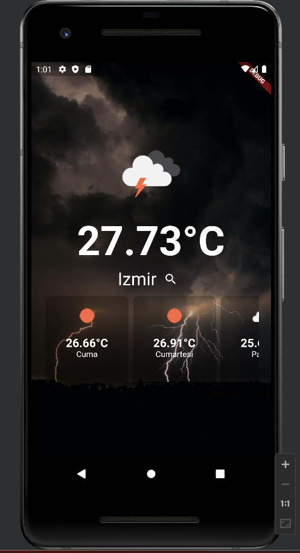
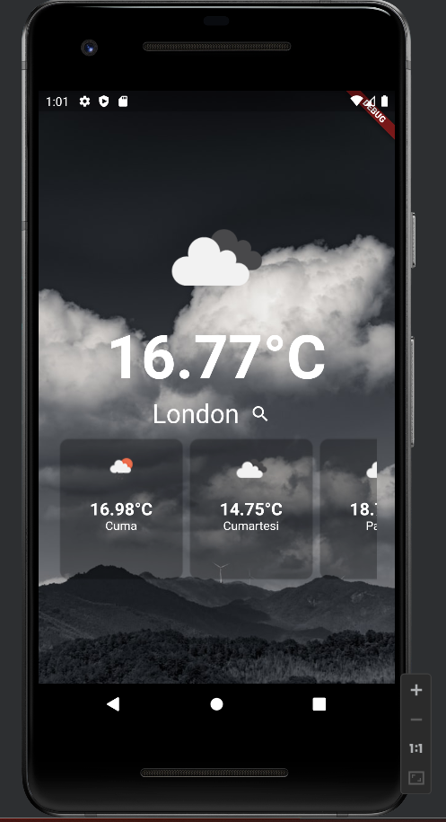
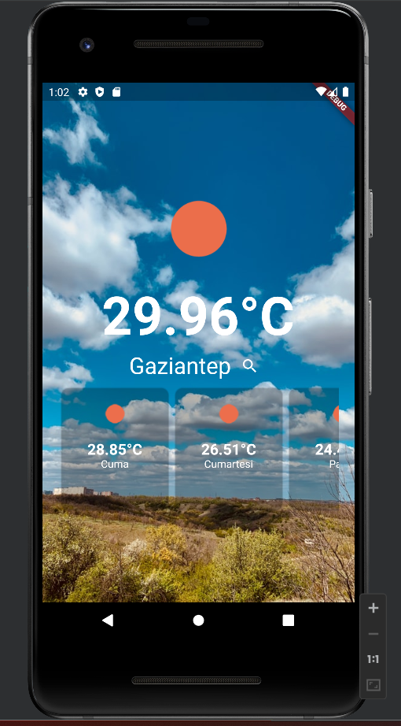
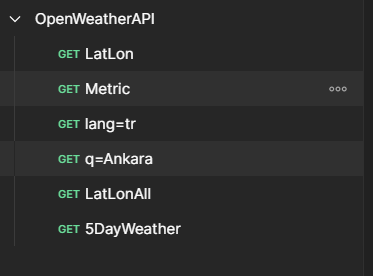
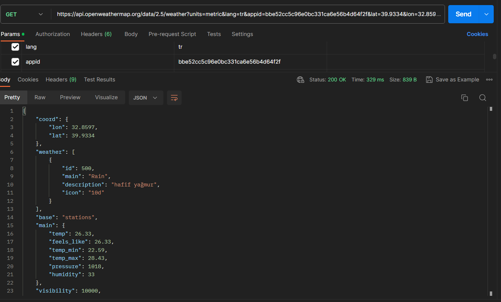

# Weather App

-> Flutter ve OpenWeatherApi kullanılarak hazırlanmış hava durumu uygulamasıdır.(tr)

->It is a weather application developed using Flutter and OpenWeatherApi.(en)


## API Kullanımı (API Usage)

#### O güne ait sıcaklık verisi getir. (Retrieve temperature data for that day.)

```http
  GET https://api.openweathermap.org/data/2.5/weather?units={}&lang={}&appid={}&lat={}&lon={}
```

| Parametre | Tip     | Açıklama                |
| :-------- | :------- | :------------------------- |
| `units` | `string` | **Opsiyonel**. Sıcaklık birimi. |
| `lang` | `string` | **Opsiyonel**. Açıklama dili. |
| `appid` | `string` | **Gerekli**. API Key. |
| `lat` | `string` | **Gerekli**. Latitude değeri. |
| `lon` | `string` | **Gerekli**. Longitude değeri. |


#### Önümüzdeki 40 saate ait sıcaklık verisi getir. (Retrieve temperature data for the next 40 hours.

)

```http
  https://api.openweathermap.org/data/2.5/forecast?q={}&appid={}&units={}&lang={}
```

| Parametre | Tip     | Açıklama                |
| :-------- | :------- | :------------------------- |
| `q` | `string` | **Gerekli**. Şehir verisi (Lat,Lon verisi de kullanılabilir.). |
| `lang` | `string` | **Opsiyonel**. Açıklama dili. |
| `appid` | `string` | **Gerekli**. API Key. |
| `lat` | `string` | **Gerekli**. Latitude değeri. |
| `lon` | `string` | **Gerekli**. Longitude değeri. |
  
## Kullanılan paketler (Packages used)

- http: ^1.1.0 (HTTP isteği atmak için.)
- geolocator: ^10.1.0 (Gps verisi çekerek konuma göre hava durumu bilgisi getirmek için.)


  
## Kullanım/Örnekler

- Giriş Ekranı (Home Screen)
Proje iki ana ekrandan oluşmaktadır. Giriş ekranında kullanıcının konum bilgisine göre hava durumu verisini çekip ana ekranda göstermektedir. Hava durumu bilgisine göre arkaplan resimleri değişmektedir. Ve 5 günlük tahmini hava durumu verisi kayan liste şeklinde kullanıcıya sunulmaktadır.(tr)

The project consists of two main screens. On the entry screen, it fetches weather data based on the user's location and displays it on the main screen. Background images also change according to the weather conditions. Additionally, a 5-day weather forecast data is presented to the user in the form of a scrolling list.(en)

- Arama Ekranı (Search Screen)
Kullanıcı bu ekranda istediği konumu girip, servisin sunmuş olduğu tüm konumlardaki hava durumu verisine ulaşabilmektedir.(tr)


On this screen, the user can enter any location they desire and access weather data for all the locations provided by the service.(en)

## Ekran Görüntüleri (Screenshots)









  
